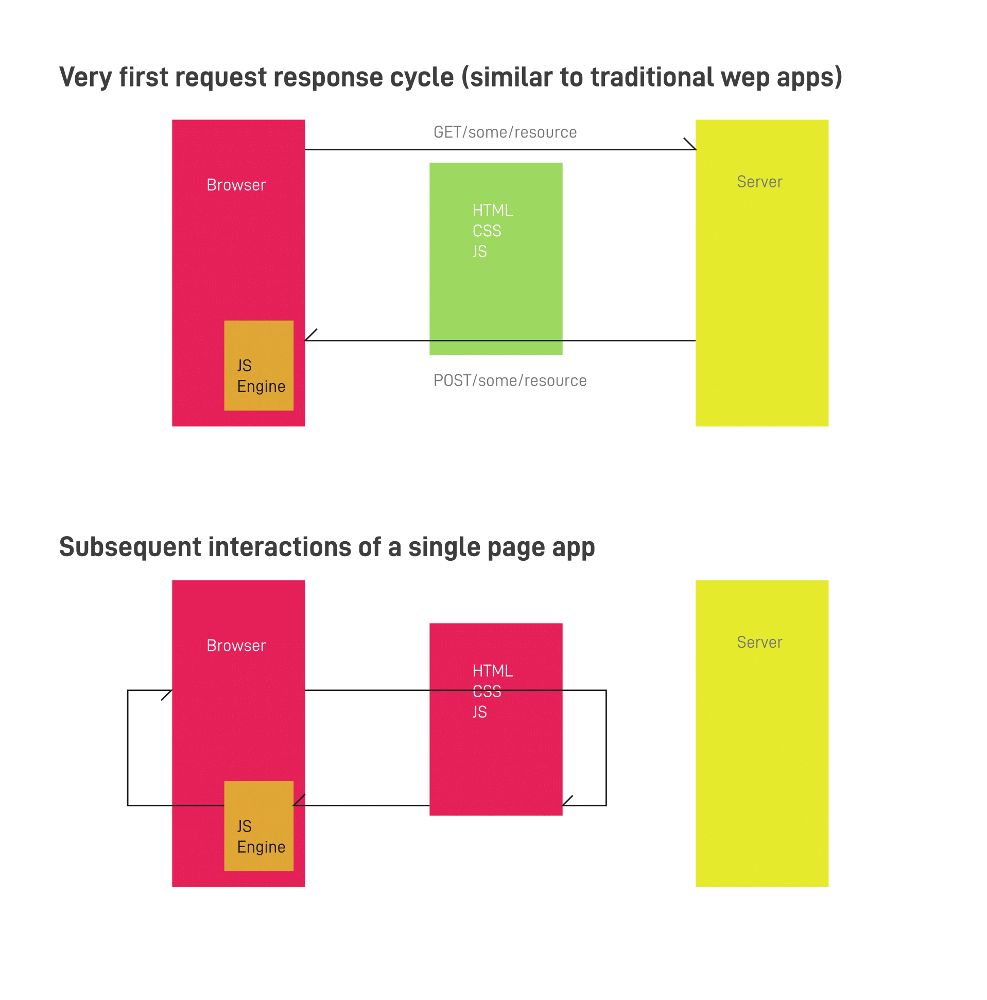
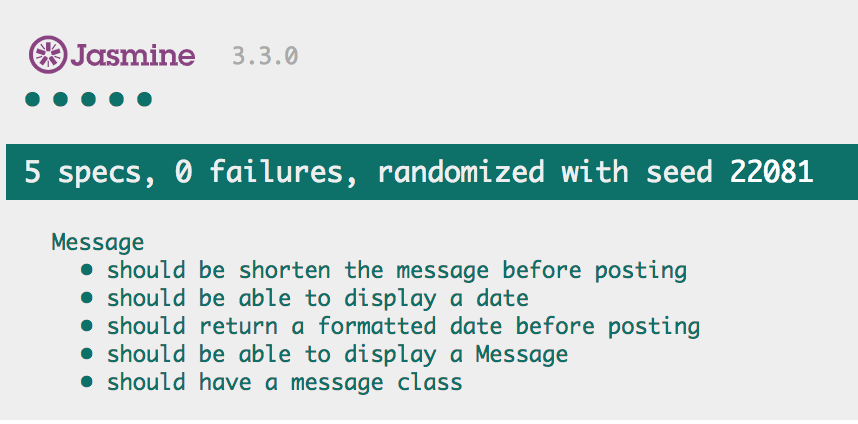

# Daily Motivations App Javascript

A simple web app that allows users to post their daily motivations. 

QuickStart
----------
* `git clone https://github.com/CazaBelle/messenger-app-js.git`
* `cd messenger-app-js`
* `open index.html`
* Alternatively, visit [here](last-goldfish.surge.sh) to interact with deployed version

User Stories 
----------
```
As a user
So I can send a message
I want to be able to post a message

As a user 
So I can see my message
I want messages displayed

As a user
So I know what time I sent a message 
I want message displayed with time created

As a user 
So I can stay updated on the most recent messages
I want newest messages displayed at the top 

```
Requirements
----------
```
*Message Board Requirements:*

- User sees a page that has
   - A title
   - A form (text box and button)
   - All the messages with a timestamp in reverse chronological order (newest at the top)
- User can input text of a message
- User can click on the button and see the new message at the top of the previous messages
- The logic of this app should be tested
- The logic should be encapsulated in classes
```

REQUEST/RESPONSE MODEL
----------------------


Testing
----------
* `open SpecRunner.html`



Deployment instructions
-----------------------
To deploy your own project on surge: 
* Ensure have an updated version of [Node](https://nodejs.org/en/)
* `npm install --global surge` #installs surge
* Navigate into project path 
* `surge` #login or signup with email and password
* Visit the domain path surge deploys

DEMO
----


